Repository voor Webots projecten bij OLOD Robot Design

2024 - 2025 Electronica-ICT, Cybersecurity & Cloud

# Projecten
## Project playfield
Jouw taak bestaat er in om een playfield te ontwerpen, in Webots, voor een e-puck wedstrijd.

### Doel
Het doel is om deze robot van een startlocatie autonoom te laten verplaatsen naar een andere locatie.

### Vereisten
Wat moet je realiseren?
* Een wedstrijdveld omringd door muren
* Het wedstrijdveld is 2 x 4 m groot
* Het bevat één startlocatie weergegeven met een rechthoek
* Bevat één eindlocatie weergegeven met een cirkel
* Moet bestaan uit verschillende lijntracks bevatten tussen de locaties
    - Er onderweg gekozen kan worden tussen verschillende alternatieven wegen die terug samenkomen op één punt
    - De tracklijn op één punt volledig onderbroken is gedurende een "grote" afstand. De robot dient hier muren te volgen.
    - De tracklijn op een bepaald gedeelte een stippellijn zijn
    - Op één punt moet de de lijn zichzelf haaks kruisen
    - Er minstens 1 bal en 2 dozen aanwezig zijn die verplaats kunnen worden. Je moet tijdens de simulatie de weg kunnen blokkeren.

# Oefeningen
## sensoren 1: Analoge afstandssensor als digitale sensor
### Beschrijving
Gebaseerd op - Webots Tutorial Project Wall follower robot using e-puck - Kajal Gada

### 1. Doelstelling
Doelstelling van deze oefening is om een analoge sensor in te zetten als digitale sensor. Dit doe je door een robot te programmeren die een muur zal volgen, gebruik makende van de e-puck Distance sensors. 
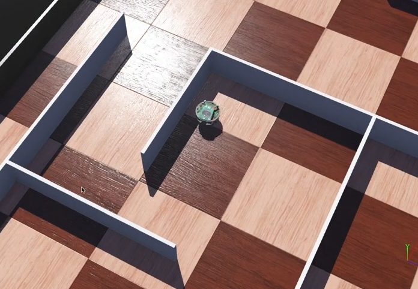

### 2. Nieuw project
Maak een nieuw project aan.

#### Hands-on #1:
Start Webots en maak een nieuw project aan startend vanuit het menu **File / New / New Project Directory...** en geef de wereld de naam <blib>World_maze.wbt</blib>. 
Vergeet niet om alle checkboxes aan te vinken, inclusief de "Add a rectangle arena"

Als resultaat wordt er een speelveld getoond. 
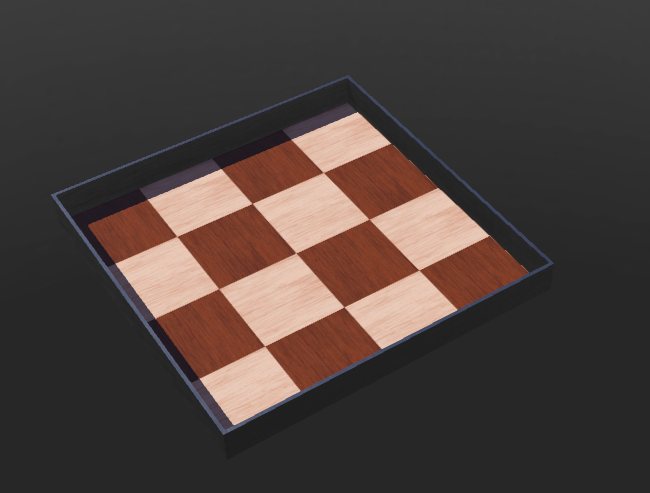 

### 3. Wereld en robot creëren
Je gaat het speelveld vergroten zodat je een doolhof (maze) kan bouwen.

#### Hands-on #2:
Selecteer <blib>RectangleArena</blib> en pas <blib>floorsize</blib> aan van 1x1m naar 2x2m.

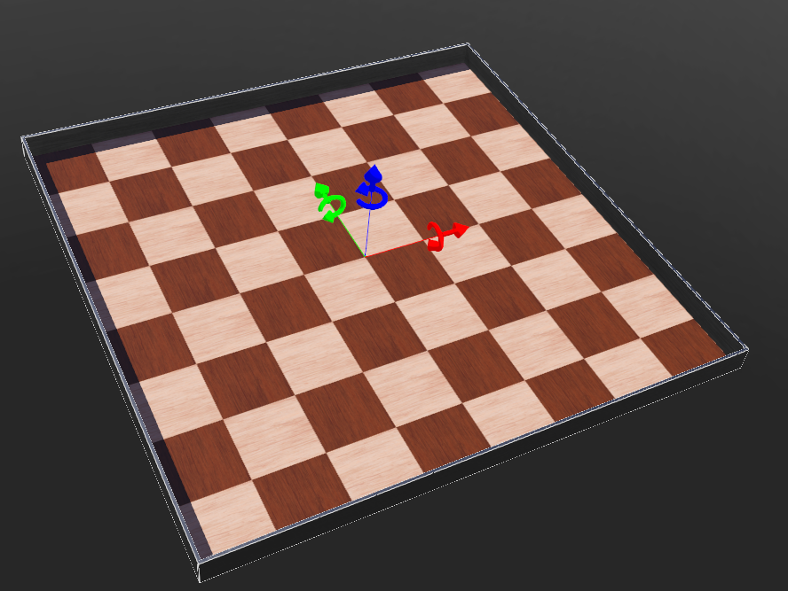 
Voeg een robot toe.

### Hands-on #3:
Voeg een e-puck robot toe. Selecteer de laatste node in de tree view.  Klik op de <blib>Add</blib> drukknop bovenaan in het scene tree. In de dialoog box kies je <blib>PROTO nodes (Webots Projects) / robots / gctronic / e-puck / E-puck (Robot)</blib>. Een e-puck robot verschijnt in het midden van het speelveld.

### 4. Muren toevoegen
Het doolhof moet voorzien worden van muren. Je gaat muren toevoegen, geen rectangles.

#### Hands-on #4:
Selecteer de laatste node in de scene tree view. Klik op de <blib>Add</blib> drukknop bovenaan in het scene tree. In de dialoog box kies je <blib>PROTO nodes (Webots Projects) / objects / apartment_structure / wall (Solid)</blib>. Een gigantische muur verschijnt in het midden van het speelveld.

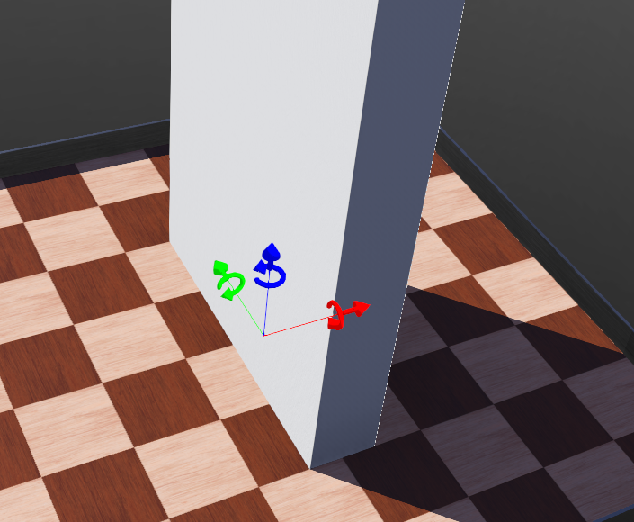

#### Hands-on #5: Verklein de muur naar 1 x 0.01 x 0.1m.

Voeg als hulpmiddel toe een standaardassenkruis toe in de rechteronderhoek via View / Optional Rendering / Show Coordinate System. Verplaats vervolgens de muur via <blib>translation</blib> naar -0.5, 0 , 0.

#### Hands-on #6:
Maak gebruik van Copy & Paste om de muren uit te breiden. Een nieuwe muur verschijnt op de plaats van het origineel waardoor er 2 muren op elkaar worden geplaatst. M.b.v. de shift en linkermuistoets kan je de muur verplaatsen. Zorg ervoor dat je onderstaande opstelling creëert.

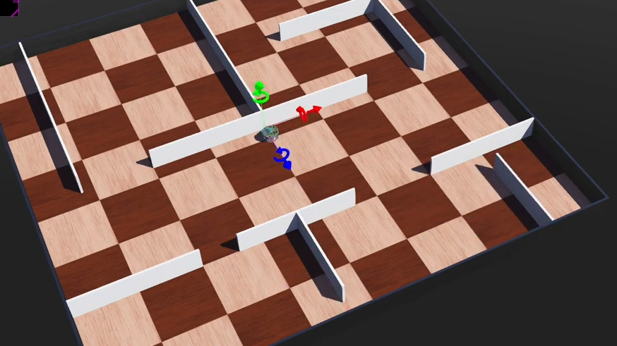 
Bewaar je wereld.

### 5. Robot controller
#### Hands-on #7:
Maak een nieuwe Python controller aan genaamd <blib>my_controller_wall_follower</blib> via het **File / New / New Robot Controller...** menu. Selecteer de optie "Open epuck_go_forward.py in Text Editor" of open dit bestand via jouw IDE.

Vervolgens voegen we deze controller toe aan de E-puck robot.

#### Hands on #8:
In de scene tree, selecteer je het <blib>controller</blib> field van de <blib>E-puck node</blib>, via de field editor onder de scene tree, druk je op de <blib>Select...</blib> drukknop en selecteer je <blib>my_controller_wall_follower</blib> uit de lijst. Wanneer de controller is toegekend aan de robot bewaar je de wereld.

Je gaat wat meer structuur brengen in je softwarecode door
* Een run_robot functie toe te voegen m.b.v. de def instructie
* Een robot instantie toe te voegen
* De motoren vrij te geven via <blib>getDevice</blib>, deze oneindig te laten roteren en de snelheid bij aanvang op nul te zetten
* De sensoren vrij te geven via <blib>getDistanceSensor</blib>, deze voegen we toe via een loop op de sensorennaamgeving: van "ps1" t.e.m. "ps8".

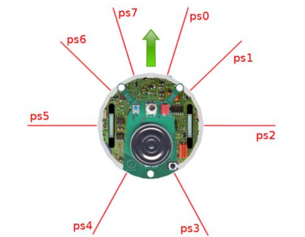

#### Vraag: Hoe maak je een main functie in Python?
In Python, fungeert de main functie als het startpunt voor de uitvoering van je code. Hierdoor kan je je code beter organiseren.
De opbouw herken je aan de <blib>if __name__ == '__main__':</blib> constructie. De <blib>pass</blib> instructie kan je verwijderen van zodra er enige code aanwezig is. Deze instructie fungeert als plaatshouder verhindert errors indien er geen code aanwezig is.

    Hands on #9: Wijzig het controller programma zoals getoond en test het:

    from controller import Robot

    def run_robot(robot):  
        # Get the time step of the current world.
        timestep = int(robot.getBasicTimeStep())
        max_speed = 6.28
        
        # Enable motors
        leftMotor = robot.getDevice('left wheel motor')
        rightMotor = robot.getDevice('right wheel motor')
        
        leftMotor.setPosition(float('inf'))
        leftMotor.setVelocity(0.0)
        
        rightMotor.setPosition(float('inf'))
        rightMotor.setVelocity(0.0)

        # Enable proximity sensors
        prox_sensors = []
        for ind in range(8):
            sensor_name = 'ps' + str(ind)
            prox_sensors.append(robot.getDistanceSensor(sensor_name))
            prox_sensors[ind].enable(timestep)
        
        # Main loop:
        # - perform simulation steps until Webots is stopping the controller
        while robot.step(timestep) != -1:
            # Read the sensors:
            for ind in range(8):
                print("ind: {}, val: {}".format(ind, prox_sensors[ind].getValue()))))
            # Enter here functions to read sensor data, like:
            #  val = ds.getValue()
        
            # Process sensor data here.
        
            # Enter here functions to send actuator commands, like:
            leftMotor.setVelocity(max_speed)
            rightMotor.setVelocity(max_speed)
           
    if __name__ == "__main__":

        #create the robot instance
        my_robot = Robot()
        run_robot(myr_robot)

Bewaar de code, maak de robot sensorstralen zichtbaar via **View / Optional Rendering / Show DistanceSensorRays**. Start de simulatie, indien correct zie je in de Console de actuele afstand van elke sensor verschijnen.

Oeps! De code bevat een fout. Zoek de fout en corrigeer deze!

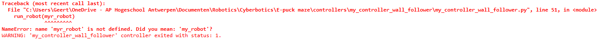

#### Vreag: wat is er fout?
De laatste lijn bevat een typefout "my_robot" is fout getypt. Pas de fout aan en vergeet niet om je code te bewaren. De simulatie werkt nl. enkel met bewaarde bestanden.

### 6. Sensoren
A.d.h.v. de sensorstatus in combinatie met de mogelijke situaties kunnen we een beslissingstabel opstellen.

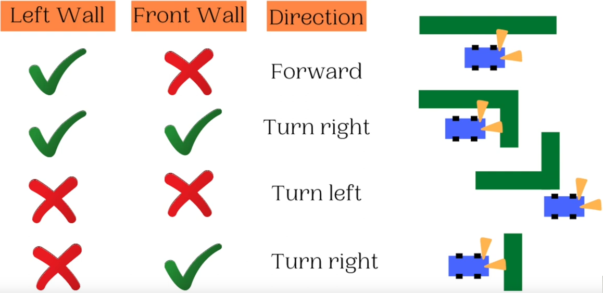 
De figuur maakt duidelijk dat we gebruik maken van
* Sensor ps5 om een muur links te detecteren
* Sensor ps7 om een muur voor de robot te detecteren
* Beide sensoren werken op basis van JA/NEEN signalen, we moeten dus een vergelijkingsinstructie gebruiken om de afstandsmeting om te zetten naar een TRUE/FALSE signaal

 
Verplaats de robot opdat deze parallel staat aan een muur, op een "gewenste" afstand muur-robot. Start de simulatie en je zal merken dat de ze waarde in de buurt ligt van 80.

Je gaat dus 2 TRUE/FALSE variabelen maken die vergelijken of de 2 sensoren deze waarden overschrijden.

##### Hands on #10: Voeg onderstaande variabelen en code toe. Vergeet niet om de aansturing van de motorsnelheid bij te werken (laatste lijnen).

    # Process sensor data here.
    leftWall = prox_sensors[5].getValue() > 80
    leftCorner = prox_sensors[6].getValue() > 80
    frontWall = prox_sensors[7].getValue() > 80

    left_speed = max_speed
    right_speed = max_speed

    if frontWall:
        print("Turn right")
        left_speed = max_speed
        right_speed = -max_speed
        
    else:
        if leftWall:
            print ("Drive forward")
            left_speed = max_speed
            right_speed = max_speed  
                
        else:
            print("Turn left")
            left_speed = max_speed/8
            right_speed = max_speed 
            
                            
    # Enter here functions to send actuator commands, like:
    leftMotor.setVelocity(left_speed)
    rightMotor.setVelocity(right_speed)

Zet de robot in een goede startpositie, raadpleeg hiervoor de beslissingstabel. Test vervolgens de simulatie.

### 7. Sensoren oefening
De werking is niet optimaal. Verbeter de werking door gebruik te maken van sensor ps6 om beter hoeken te nemen.

### 8. Project bewaren
Bewaar je project, back-up je volledige projectstructuur in één zip bestand en laad dit op in de Uploadzone van de oefeningen.

## sensoren 2: IR sensor
### 2.
Maak het speelveld 1x2 meter groot en plaats hierop de [gegeven](info/sensoren1-Arena.png) tekening.

#### Hands-on #2:
Verwijder de FloorAppearance node en voeg een PBRAppereance toe in de plaats binnen in de RectangleArena.
* In de FloorAppereance voeg je een imageTexture toe aan de baseColorMap
* In de baseColorMap kan je via add drukknop het .jpg/.png bestand toevoegen.
* In de FloorAppereance verander je de waarde van metalness van een 1 naar een 0 om het veld wit te maken.
* Verander de FloorTileSize naar gelang je image, dit zou ongeveer dezelfde waardes moeten zijn als de FloorSize.

Als resultaat wordt er een speelveld getoond. 

### 3. Robot toevoegen
Je gaat een IR sensor toevoegen aan het grondslot van de e-puck robot.

#### Hands-on #3:
Voeg een e-puck robot toe en selecteer het <blib>groundSensorsSlot</blib> van de e-puck. Klik op de <blib>Add</blib> drukknop en voeg het Base node het <blib>DistanceSensor</blib> toe. Stel Type</blib> in opf Infra-red. Stel de naam van het slot in op "IR".

Maak de stralen van de DistanceSensors zichtbaar, en kijk vervolgens onder de robot. De nieuwe sensor kan je enkel bekijken via de onderzijde. Bewaar je wijzigingen.

### 4. Sensoren
Je gaat 2 infrarood sensoren toevoegen, in het voorziene slot voor grondsensoren, die de lijn voor de robot zullen detecteren. Deze sensoren plaats je onder hoek met een onderlinge afstand van ongeveer tweemaal de lijndikte.

#### Hands-on #4: Selecteer de e-puck robot.
Voeg een <blib>DistanceSensor</blib> aan het GroundSensorSlot en geef deze de naam "IR_Right". Wijzig het <blib>type</blib> naar <blib>infra-red</blib>. Verplaats de sensor op een hogere locatie en onder een hoek. De translatie stel je in op <blib>x=0 m, y=-0.015 m, z=0.01 m</blib>. De rotatie rond de y-as stel je in op 15°. Voeg tot slot een kleurherkenning toe die je instelt op zwart. Selecteer <blib>recognitionColors</blib> en voeg een kleur toe via de Add drukknop. Alle waarden in de RGB velden stel je in op 0 wat overeenkomt met de zwarte kleur.

Hierna is het de beurt aan de 2de sensor

#### Hands-on #5:
Herhaal dit voor de 2 de infrarood sensor welke je de naam "IR_Left" geef. De locatie van de sensor is bijna gelijk aan de vorige sensor. Enkel de y-as dien je op de positieve waarde in te stellen.

Bewaar je wijzigingen.

### 5. Controller
Voeg een Python controller toe aan de e-puck robot en noem deze <blib>my_controller_line_follower</blib>.

#### Hands on #7:
In de scene tree, selecteer je het <blib>controller</blib> field van de <blib>E-puck</blib> node, via de field editor onder de scene tree, druk je op de <blib>Select...</blib> drukknop en selecteer je <blib>my_controller_line_follower</blib> uit de lijst. Wanneer de controller is toegekend aan de robot bewaar je de wereld.

Vervolgens maak je een main en run_robot functie aan en activeer je de motoren en sensoren.

#### Hands on #9: Wijzig het controller programma zoals getoond en test het:

    from controller import Robot
    varMax_speed = 6.28

    def run_robot(robot): 

    # get the time step of the current world.
        timestep = int(robot.getBasicTimeStep())

        # Enable motors
        oLeftMotor = robot.getDevice('left wheel motor')
        oRightMotor = robot.getDevice('right wheel motor')
        
        oLeftMotor.setPosition(float('inf'))
        oLeftMotor.setVelocity(0.0)
        
        oRightMotor.setPosition(float('inf'))
        oRightMotor.setVelocity(0.0)
        
        # Enable IR sensors
        iLeftIR = robot.getDevice('IR_Left')
        iLeftIR.enable(timestep)
        iRightIR = robot.getDevice('IR_Right')
        iRightIR.enable(timestep)

        # Main loop:
        # - perform simulation steps until Webots is stopping the controller
        while robot.step(timestep) != -1:
            mLeftSpeed = varMax_speed
            mRightSpeed = varMax_speed 
            
            # Read the IR sensors:
            mLeftIR_Value = iLeftIR.getValue()
            mRightIR_Value = iRightIR.getValue()
            print("left: {} right: {}".format(mLeftIR_Value, mRightIR_Value))

            # Enter here functions to send actuator commands, like:
            oLeftMotor.setVelocity(mLeftSpeed)
            oRightMotor.setVelocity(mRightSpeed)
                   
    if __name__ == "__main":

        #create the robot instance
        my_robot = Robot()
        run_robot(my_robot)

Bewaar de code en test de werking.
1. Versleep de robot naar een lijn
2. Start de simulatie en bekijk de sensoruitgangswaarden in de Console
3. Noteer de waarde voor een witte en een zwarte achtergrond.
4. Pauzeer indien nodig

### 6. Werking
A.d.h.v. de sensorstatus in combinatie met de mogelijke situaties ben jij nu in staat om een beslissingstabel op te stellen.
* Beide sensoren detecteren geen zwarte kleur
    - = "gewoon" rechtdoor rijden
* Linkse sensor detecteert een zwarte kleur, rechts niet
    - =draai naar links door het linkse wiel achterwaarts te laten draaien
    - Maak gebruik van een vergelijkingsinstructie om de waarde van de linkse sensor met die van de rechtse te vergelijken EN je moet zeker zijn dat je zwart detecteert
* Rechtse sensor detecteert een zwarte kleur, links niet
    - =draai naar rechts door het rechtse wiel achterwaarts te laten draaien
    - Maak gebruik van een vergelijkingsinstructie om de waarde van de rechtse sensor met die van de linkse te vergelijken EN je moet zeker zijn dat je zwart detecteert
* Beide sensoren detecteren een zwarte kleur
    - = PROBLEEM > Situatie die niet mag voorkomen, stel jezelf de vraag wat je moet wijzigen aan robot of de volglijn om dit op te lossen.

Je zal verschillende problemen tegenkomen waarvoor jij een oplossing moet zoeken.
* Probleem : Robot verliest de lijn!
    - Oorzaak = Snelheid te hoog
    - Oplossing = Verlaag de snelheden door bijv. te vermenigvuldigen met een komma-getal
* Probleem : Robot is niet zo stabiel in het rijgedrag!
    - Oorzaak = De vergelijkingsinstructies reageren te snel
    - Oplossing = Corrigeer enkel in dien het verschil tussen de 2 sensoren een bepaalde min. waarde heeft

### 7. Project bewaren
Bewaar je project, back-up je volledige projectstructuur in één zip bestand en laad dit op in de Uploadzone van de oefeningen.

# Webots tutorials
## Tutorial 6
In deze tutorial ga jij je eerste robot bouwen vanaf nul. De robot zal bestaand uit een robotframe, 4 wielen en 2 afstandssensoren. Het resultaat zie je hieronder.
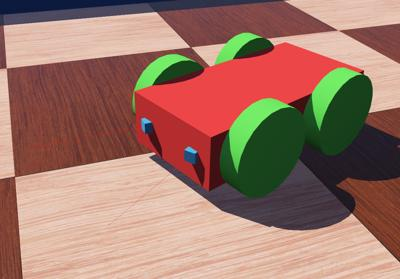

### Stap 2
Voeg een robot node toe op het einde van de scene tree, welke vier **HingeJoint nodes** welke elk een **Solid node** hebben als **endPoint** (zie figuur hieronder). Voeg een **Shape node toe**, aan de Robot node, welke een **Box geometrie** bevat. Stel de kleur van de Shape in op **rood**. Gebruik deze Shape om het **boundingObject** veld te bepalen van de Robot node. Box afmetingen zijn `(0.2, 0.1, 0.05)`. Voeg een **Physics node** toe aan de Robot. De figuur toont alle nodes die samen de robot definiëren.  Enkel de directe children nodes van de root Robot node ontbreken nog.

### Stap 3
Voeg een **HingeJointParameters node** toe, en voeg de de waarden die hierboven omschreven zijn toe. Voer de andere wielen moet je uiteraard aangepaste waarden invoeren. Some signs obviously have to be updated for other wheels.

### Stap 4
Vervolledig door de ontbrekende nodes toe te voegen zodat je onderstaand geheel bekomt. Vergeet niet om de Physics nodes te bepalen.
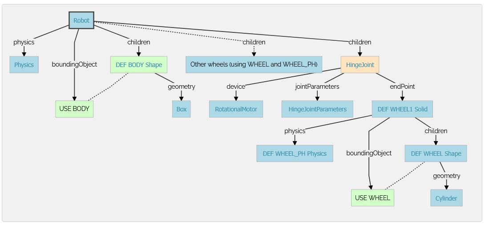

### Stap 5
Voeg  de twee afstandssensoren toe. Deze staan onder een hoek van 0.3 [rad] t.o.v. de Z-as van het robotlichaam. Stel de grafische en physical shape in op een kubus (Cube) waarbij elke zijde 0.01 [m] bedraagt. Stel de kleur in op blauw. Stel het name veld in op de tagnamen van de figuur in hoofdstuk doelstelling.

### Stap 6
Voeg een controller toe en noem deze `four_wheeled_collision_avoidance` welke de robot zal laten bewegen en botsingen zal vermijden m.b.v. de afstandssensoren.

## Tutorial 7
### 1. Doelstelling
Doelstelling is om een PROTO bestand te ontwerpen voor de 4 wielen van de vorige tutorial.

### 2. Kopieer de robot definitie
De robot uit de vorige tutorial is volledig gedefinieerd in het world bestand. Door dit te verplaatsen naar een PROTO bestand kan je een robot importeren in andere wereld.

#### Hands-on #1:
Open het world bestand van vorige tutorial in een teksteditor (bijv. kladblok) . Maak een nieuw leeg tekstbestand (.txt) aan in de <blib>protos</blib> map van je project en noem deze <blib>FourWheelsRobot.proto.</blib> Open dit bestand in de teksteditor.

De structuur van een PROTO bestand ziet eruit als volgt

    #VRML_SIM R2023b utf8
    PROTO protoName [
        protoFields
    ]
    {
        protoBody
    }

De <blib>protoName</blib> moet de naam zijn van jouw PROTO bestand (<blib>FourWheelsRobot</blib> in dit geval), in <blib>protoFields</blib> defineer je de aanpasbare velden van de PROTO node (laten we nog even leeg) en de protoBody is de definitie van de root node (i.e. the Robot node in this case).

#### Hands-on #2:
Schrijf de standaard structuur in het PROTO bestand met de correcte <blib>protoName</blib>. Van het <blib>4_wheels_robot.wbt</blib> wereld bestand kopieer je de robot node (start met <blib>Robot {</blib> en eindigt met het laatste <blib>}</blib>) en plak je het in jouw PROTO bestand in plaats van het <blib>protoBody</blib>. Bewaar tot slot het PROTO bestand.

Oplossing: Deze zou er zo moeten uitzien:

    #VRML_SIM R2023b utf8
    PROTO FourWheelsRobot [

    ]
    {
        Robot {
            # list of fields
    }
    }

### 3. PROTO gebruiken
De nieuwe PROTO node is nu beschikbaar voor elke wereld in je huidig project.
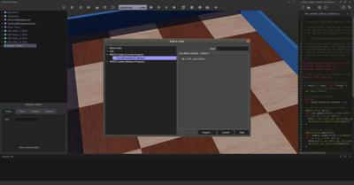 
De PROTO is nu zichtbaar in het "Add a node" venster.

#### Hands-on #3:
Open de <blib>4_wheels_robot.wbt</blib> wereld in Webots en voeg de <blib>FourWheelsRobot</blib> node toe (welke je net hebt aangemaakt). Je vindt het bestand in <blib>PROTO nodes (Current Project) / FourWheelsRobot (Robot)</blib>.

### 4. Velden toevoegen
Je zal al gemerkt hebben dat deze nieuwe PROTO node geen enkel veld heeft waardoor het niet mogelijk is om translate, rotate of controller wijzigingen uit te voeren. It is very easy to add new fields to a PROTO node and to link them with internal fields. This should be done in the PROTO interface part (part between the <blib>[</blib> and the <blib>]</blib>).

#### Hands-on #4:
Bewerk je PROTO bestand in een teksteditor en voeg de definities toe van de translation, rotation en <blib>bodyMass</blib> velden in hte PROTO interface gedeelte:

    field SFVec3f    translation  0 0 0
    field SFRotation rotation     0 0 1 0
    field SFFloat    bodyMass     1

Je PROTO node heeft nu twee open velden maar deze zijn niet gelinkt naar enig intern veld. Om deze link te maken gebruik he het IS keyword. Vervang het <blib>translation x y z</blib> en <blib>rotation x y z</blib> angle velden van de Robot node:

    translation IS translation
    rotation IS rotation

Voeg het <blib>mass</blib> veld aan de Physics node van de Robot node toe:

    mass IS bodyMass   

Bewaar je PROTO bestand, welke er ongeveer uitziet als volgt:

    #VRML_SIM R2023b utf8
    PROTO FourWheelsRobot [
        field SFVec3f    translation  0 0 0
        field SFRotation rotation     0 0 1 0
        field SFFloat    bodyMass     1
    ]
    {
        Robot {
            translation IS translation
            rotation IS rotation
            children [
            # list of children nodes
            ]
            boundingObject USE BODY
            physics Physics {
            density -1
            mass IS bodyMass
            }
            controller "four_wheels_collision_avoidance"
        }
    }

Je kan nu je simulatie bewaren. De <blib>translation</blib>, <blib>rotation</blib> en <blib>bodyMass</blib> van de <blib>FourWheelsRobot</blib> node kan je nu aanpassen (in de scene tree of via het 3D venster).

Hetzelfde mechanisme kan je gebruiken voor het <blib>controller</blib> veld van de Robot node. 
De oplossing kan je [hier](info/tutorial7-oplossing-FourWheelsRobot.proto.txt) terugvinden.

### 5. Project bewaren
Bewaar je project, back-up je volledige projectstructuur in één zip bestand en laad dit op in de Uploadzone.
